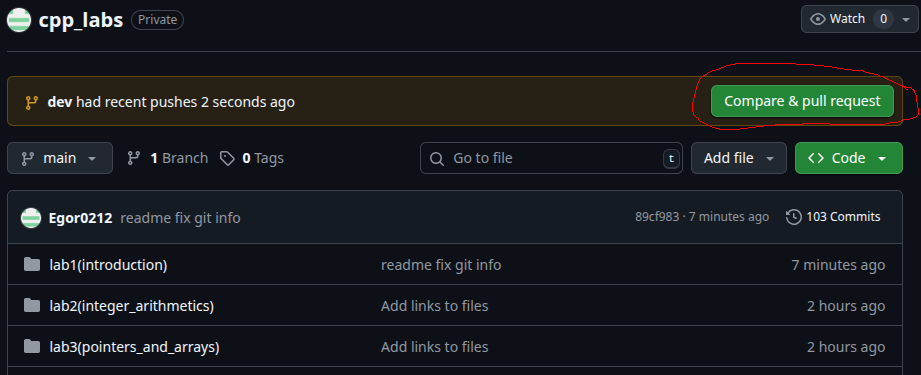
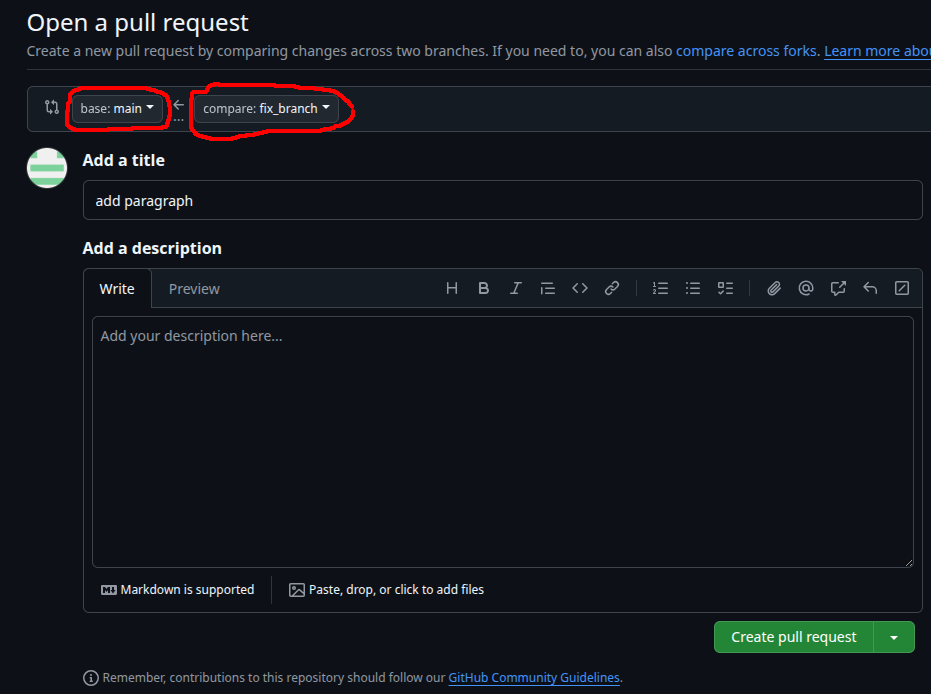
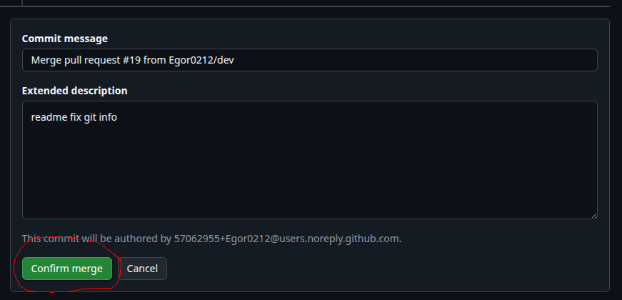
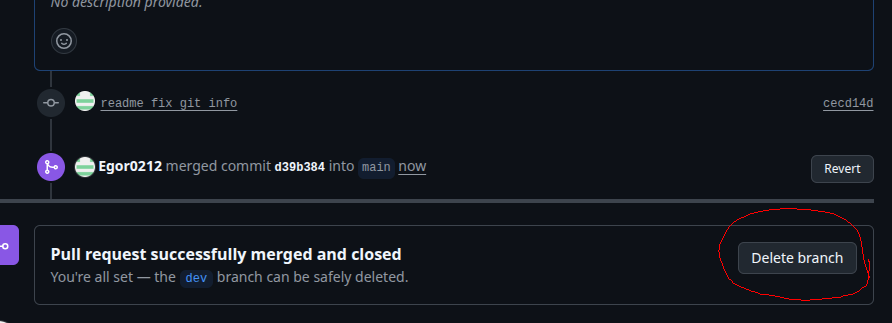

# Лабораторная работа №1. Знакомство с языком программирования C++
В рамках первого занятия вам предстоит познакомиться с основами языка C++ (напишем и разберём подробно первую программу), а также с системой контроля версий **Git**, с которой мы будем работать на протяжении семестра.

## Организационные моменты

### Структура задач

Каждая лабораторная работа находится в своей директоии в репозитории (например, эта находится в папке **lab1_introductioin**). Каждая директрия имеет свой файл **README.md** (иногда их может быть несколько), в котором описана суть вашего задания и, возможно, какая-то дополнительная информация, и файл в формате **.pdf**, где находится условие.

> В папке [tutorials](../../tutorials/) находятся полезные для нашего курса материалы (например, про генерацию случайных чисел в C++). Настоятельно рекомендую туда заглянуть.

Выполнять лаботаторную работу можно (даже нужно!) прямо в этой же папке, т.е. можно создавать/удалять файлы, редактировать файлы (кроме файлов с заданиями!), если иного не сказано в задании. После чего вы загружаете свои исходные файлы в свой репозиторий(см. "Задания к лабораторной работе").

### Требования к сдаче лабораторных работ

Для сдачи лабораторных работ мы будем использовать систему контроля версий github (более подробно про это будет описано ниже). Именно сюда вы будете загружать свои работы. 

Однако для успешной сдачи лабораторной работы недостаточно лишь залить её на github. Также нужно защитить работу преподавателю **лично**(это делается на занятиях).

### Используемые технологии

Фрагменты кода на занятиях я буду демонстрировать в теминале linux (у меня стоит Ubuntu 25.04), используя текстовый редактор Vim (иногда Visual Studio Code). В качестве консоли под Windows буду использовать WSL (Windows Subsystem for Linux) с версией Ubuntu 22.04.

В вашем случае для написания кода вы можете использовать то, что вам удобнее — будь то текстовый редактор или какая угодно среда разработки (например CLion или Microsoft Visual Studio). Я же советую уже сейчас попробовать поработать с консолью, установив WSL или ОС Linux.

## Git

Практически каждый современный проект использует системы для контроля версий. Git — самый популярный инструмент для этого. Здесь не будет подробного гайда по использованию этой платформы, т.к. самый верный способ обучиться владению Git — испытать его своими руками. Оставлю несколько ресурсов, в которых подробно расписаны первые шаги, а также настройка Git:
- [Version Control with Git](https://learn.epam.com/catalog/detailsPage?id=601f195a-d408-4439-a16d-0630ed2a412e) — курс от EPAM, в котором собраны основные концепции работы с платформой(**обращаю внимание**, что для доступа к курсу необходимо быть зарегистрированным на сайте).
- [GitHowTo](https://githowto.com/ru) — сайт("интерактивный учебник"), знакомящий вас с основами Git.

В рамках предмета мы будем работать с одним репозиторием [fpmi_cpp_labs](https://github.com/Egor0212/fpmi_cpp_labs). Каждому студенту нужно сделать ответвление от этого репозитория к себе на свой аккаунт github (так назыавемый **fork**), с которым он будет работать и загружать результаты своей проделанной работы. Как это сделать будет подробно разобрано на занятии.

### Клонирование репозитория

Вы сделали ответвление (fork) основного репозитория себе на аккаунт (это мы обсудили на занятии). Для начала работы с этим репозиторием нужно "клонировать" его локальную копию себе на компьютер:
```
git clone "ссылка на ваш репозиторий"
```

Периодически репозиторий с заданиями может обновляться. Загрузить последнюю версию ветки main себе в ответвлённый репозиторий можно прямо на сайте github (над репозиторием будет кнока **"Synk fork" -> "Update Branch"**). После этого, чтобы загрузить эти изменения локально, нужно выполнить следующие команды:

```shell
# Убедитесь, что находитесь у себя в ветке main
# и у вас нет локальных изменений,
# если есть — зафиксируйте локальную работу (см. "Задания к лабоработной работе №1")
git checkout main
git status

git pull # синхронизации локального репозитория с удаленным
```

Ниже покажу два способа, как всё можно сделать через консоль (будет немного сложнее, чем команда git pull):
```shell
# Общее для двух способов:

# добавить мой репозиторий с заданиями как удалённый (remote) с 
# названием upstream (делается один раз!)
git remote add upstream git@github.com:Egor0212/cpp_labs.git

# Убедитесь, что находитесь у себя в ветке main
# и у вас нет локальных изменений
# если есть — зафиксируйте локальную работу (см. "Задания к лабоработной работе №1")
git checkout main
git status
```
1. С помощью merge (слияния):
```shell
# "Вытягивание" изменений из моего удалённого 
# репозитория в ваш локальный
# по сути git pull = git fetch + git merge
git pull upstream main

# Обновления вашего удалённого репозитория
git push origin main
```  
2. С помощью rebase ("переноса"):
```shell
# "Извлечь" (fetch) все ветви из моего удалённого репозитория в ваш
git fetch upstream

# Убедитесь, что находитесь у себя в ветке main
git checkout main

# Перенести коммиты из моей ветви в вашу
git rebase upstream/main

# Загрузить изменения в ваш удалённый репозиторий
# (параметр -f используется только первый раз после rebase)
git push -f origin main
```

### Создание веток
После клонирования ответвленного репозитория себе вы увидите в нём только одну ветку (она называется  **main**), с которой вы будете продолжать работать на протяжении всего семестра. Обычно изменения в эту ветку загружаются на самой последней стадии разработки (после ревью кода, тестирования и т.п.). Для упрощения вы можете работать напрямую с веткой main (вам тогда не понадобится никакого слияния веток), но я рекомендую сразу учиться делать хорошо, чтобы потом не переучиваться.

> Стоит отметить, что ещё в репозитоии помимо ветки main есть ещё так называемая ветка **dev**. Она служит в качестве "интеграционной" ветки, где собираются изменения из различных веток разработки (их обычно назвают **feature-ветки**) перед тем, как они будут объединены в основную ветку main (или master).
 
Обычно для каждой новой задачи создаётся своя feature-ветка с характерным для этого названием (например feature1_add_logic, featue_solve_task1 и т.п), в которой работают только над одной конктретной задачей. Создать ветку можно, например, с помощью следующей команды:

```
git checkout -b "название_ветви"
```
При создании ветви командой выше, вы автоматически на неё перейдете. Но настоятельно рекомендую проверить, на какой ветви вы находитесь Это можно сделать с помощью команды **git status**. Если же вы по какой-то причине не перешли на свою ветвь, то это можно сделать, например, с помощью следующей команды:
```
git switch "название ветви"
``` 
или этой команды:
```
git checkout "название ветви"
``` 

После чего можно приступать к работе в этой ветке. После окончания работы с этой веткой её обычно сливают с какой-то из основных (в нашем случае это ветка main), а саму ветку, как правило, удаляют.

## Первая программа на C++
После того, как вы клонировали репозиторий и создали свою ветвь для работы, перейдём к первой программе, так называемой $Hello, world$ на языке программирования C++:
```cpp
#include <iostream>

int main() {
    std::cout << "Hello, world!" << std::endl;
    return 0;
}
```
Разберём эту программу подробнее:
- В строке `#include <iostream>` мы подключаем библиотеку `iostream`, которая предназначена для работы с вводом и выводом данных в поток / из потока (в нашем случае мы воводим на консоль).
- `int main()` объявляет фнукцию `main`, с которой **всегда** начинается выполнение программы. Эта функция должна вернуть целое число(int).
- `std::cout << "Hello, world!" << std::endl;` — здесь мы
выводим строку $"Hello, world!"$ на консоль, используя специальный объект `std::cout` и оператор `<<`. `std::endl` переводит курсор на новую строку.
- `return 0` — возвращает из функции `main' число 0 (так называемый код завершения программы). Если программа завершается с кодом 0, то это обычно означает успешное завершение программы.

### Замечания
1. `std::endl` в данном случае можно и не использовать, указав вместо этого специальный символ в строке $Hello, world!$, также означающий переход на новую строку — `\n`. Получаем следующую программу:
```cpp
#include <iostream>

int main() {
    std::cout << "Hello, world!\n";
    return 0;
}
```
2. Зависимое имя `std::cout` означает, что мы используем объект `cout` из пространства имён `std`. Префикс `std::` можно не писать, указав, что мы добавим **все** имена из пространства имён `std` с помощью директивы `using`:
```cpp
#include <iostream>

using namespace std;

int main() {
    cout << "Hello, world!\n";
    return 0;
}
```
3. Используемый в пункте 2 метод не рекомендуется, т.к. могут возникнуть конфликты имён, из-за которых очень часто программа может работать неправильно или вообще не работать (например, в пространстве имён `std` есть функция `left` и у вас в программе будет переменная с именем `left`), и иногда бывает очень трудно найти ошибку в коде или понять, из-за чего программа не компилируется. Вместо этого я рекомендую использовать директиву `using` в "максимально узкой области видимости" (в нашем случае внести её в функцию `main` в немного другой форме). В таком случае будет гораздо легче найти ошибку, если что-то пойдёт не так:
```cpp
#include <iostream>

int main() {
    using std::cout; // будем использовать cout из std
    cout << "Hello, world!\n";
    return 0;
}
```

## Задания к лабоработной работе №1
В текущей директории создать файл **main.cpp**, в который скопировать первую программу $Hello, world!$. Попробовать скомпилировать эту программу, выполнить её (как это сделать было разобрано на занятии).

В этой же директории в файле [lab1_introduction.pdf](lab1_introduction.pdf) находятся задания к первой лабораторной работе. Из этих заданий (кроме 1 и 12) сделать 5 на выбор. Задание 1 мы разобрали на занятии, задание №12 "со звёздочкой" — подумайте, как его можно сделать.

Добавить файл **main.cpp** и файл(ы) с решением лабораторной работы в вашу ветку. Если вы работаете напрямую с веткой main, то это можно сделать, например, так:
1. добавляем все изменения перед созданием коммита
    ```
    git add/rm *
    ```
2. сам коммит:
    ```
    git commit -m "Что изменилось/добавилось/удалилось"
    ```
3. загружаем эти изменения в вашей ветке из вашего локального репозитория на удаленный (в нашем случае на Git):
    ```shell
    git push origin "название_ветки" 
    # в нашем случае git push origin main
    ```

Если же для выполения задания вы создали отдельную ветку, то эту ветко можно слить (merge) с вашей веткой main. Это тоже можно сделать несколькими способами:

1. прямо на сайте github в своём репозитории. Для этого вам придётся опубликовать вашу ветку (для этого можно использовать команды выше). После чего сайт вам сайт предложит создать pull request (над репозиторием будет кнопка **Compare & pull request**) и затем слить ветки (не забудьте указать, какие ветки вы будете сливать!):
    - <ins>Compare & pull request</ins>
        
    - <ins> Выбор веток для слияния:</ins>
        
    - <ins>Create pull request</ins>
        
    - <ins>Merge pull request</ins>
        
    - <ins>Confirm merge</ins>
        
    - <ins>Delete branch</ins>
        

> Обратите внимание, что делается это в удалённом репозитории, т.е. локально ваша ветка не удалена и не слита с веткой main! Чтобы удалить ветку локально, нужна следующая команда: `git branch -D "название_ветки"` (обращаю внимание, что сначала нужно перейти на другую ветку!). После чего можно воспользоваться командой `git pull` для синхронизации локального репозитория с удаленным.


2. с помощью команд терминала:
```shell
    # Добавляем изменения из нашей отдельной ветки
    git add/rm *
    git commit -m "Что изменилось/добавилось/удалилось"

    # Переходим в ветку main
    git checkout main

    # Сливаем изменения из нашей ветки с main
    git merge "название_ветки"

    # Удаляем нашу отдельную ветку,
    # ведь она нам больше не нужна (не ветку main!!!!)
    git branch -d "название_ветки"

    # загружаем изменения на удалённый репозиторий
    git push origin main
```
